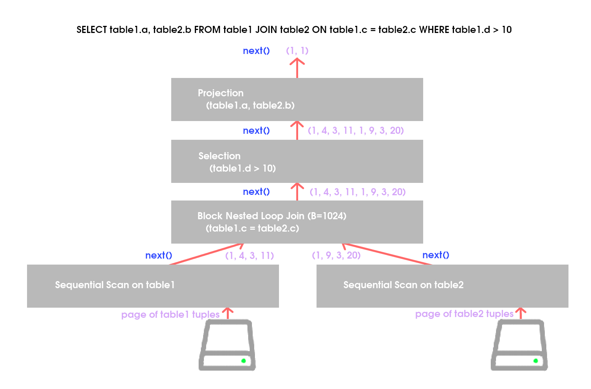
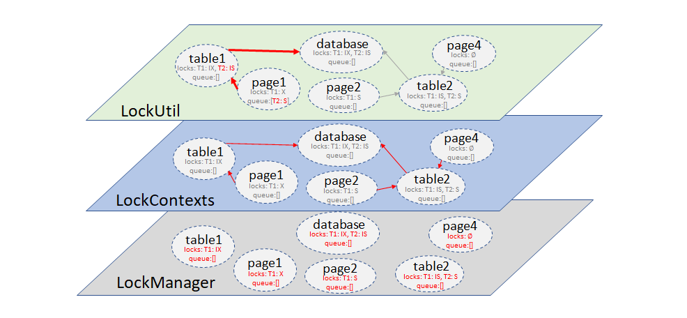

# Database
This is an implementation of a Java version of database system.

### Motivation
This project is one of the course projects from Databases Design course at UC Berkeley.  This project is to implement parts of the existing database system all done in Java.  The first part is implementing the SQL join method including left join, right join, and full join.  The second part is to optimize query processing by applying plan space search, which calculates cost estimates of plan beforehand in order to minimize final cost.  The third part is to writes codes to support database concurrency.  Using locks appropriately I can prevent another user from modifying the content of a data when I am accessing it.  Finally I implemented the recovery manager for in case the database failure happens and needs to restart.  The recovery manager uses logs to track all the modification of data before crash so that to minimize loss.

### Description
- Designed parts of the existing database system with Java.
- Implemented Relational Databases join methods, query optimizer, concurrency support, and database recovery option.
- Created technical solutions and applied engineering principles to effectively solve complex problems.

### Skills to learn
- Java
- Relational Databases

